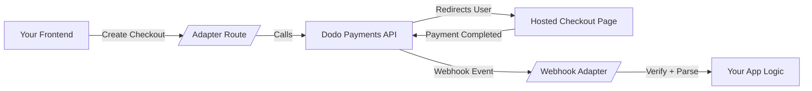

# Dodo Payments Adapters

<p align="left">
  <a href="https://discord.gg/bYqAp4ayYh">
    
  </a>
  <a href="LICENSE">
    
  </a>
</p>

Framework-specific adapters for seamless [Dodo Payments](https://dodopayments.com) integration across web frameworks.

## 🚀 Quick Start

```bash
# Choose your framework
npm install @dodopayments/nextjs     # Next.js
npm install @dodopayments/express    # Express
npm install @dodopayments/fastify    # Fastify
npm install @dodopayments/hono       # Hono
npm install @dodopayments/remix      # Remix
npm install @dodopayments/sveltekit  # SvelteKit
npm install @dodopayments/astro      # Astro
npm install @dodopayments/tanstack   # TanStack
npm install @dodopayments/nuxt       # Nuxt
npm install @dodopayments/convex     # Convex
npm install @dodopayments/better-auth # BetterAuth
bun add @dodopayments/bun            # Bun
```

### Basic Setup

```typescript
// Next.js example - app/api/checkout/route.ts
import { Checkout, Webhooks } from "@dodopayments/nextjs";

export const POST = Checkout({
  bearerToken: process.env.DODO_PAYMENTS_API_KEY!,
  returnUrl: "https://yourapp.com/success",
});

export const POST = Webhooks({
  bearerToken: process.env.DODO_PAYMENTS_API_KEY!,
  webhookSecret: process.env.DODO_WEBHOOKS_SECRET!,
  onPaymentCompleted: async (payload) => {
    // Handle payment success
  },
});
```

## 📦 Available Adapters

| Framework  | Package                    | Status |
| ---------- | -------------------------- | ------ |
| Next.js    | `@dodopayments/nextjs`     | ✅     |
| Express    | `@dodopayments/express`    | ✅     |
| Fastify    | `@dodopayments/fastify`    | ✅     |
| Hono       | `@dodopayments/hono`       | ✅     |
| Remix      | `@dodopayments/remix`      | ✅     |
| SvelteKit  | `@dodopayments/sveltekit`  | ✅     |
| Astro      | `@dodopayments/astro`      | ✅     |
| TanStack   | `@dodopayments/tanstack`   | ✅     |
| Nuxt       | `@dodopayments/nuxt`       | ✅     |
| BetterAuth | `@dodopayments/betterauth` | ✅     |
| Convex     | `@dodopayments/convex`     | ✅     |
| Bun        | `@dodopayments/bun`        | ✅     |

## 🔧 Features

- **🎯 Framework Agnostic**: Unified API across all frameworks
- **🔒 Type-Safe**: Full TypeScript support with strict typing
- **⚡ Easy Integration**: Minimal setup, maximum functionality
- **🔐 Secure**: Built-in webhook verification and validation
- **📊 Complete**: Checkout, webhooks, and customer portal

## 🏗️ Project Structure

```
packages/
├── core/                  # Shared functionality and types
├── nextjs/                # Next.js adapter (App & Pages Router)
├── express/               # Express middleware
├── fastify/               # Fastify plugin
├── hono/                  # Hono adapter
├── remix/                 # Remix action/loader support
├── sveltekit/             # SvelteKit hooks
├── astro/                 # Astro endpoints
├── tanstack/              # TanStack Start adapter
├── convex/                # Convex backend component
├── nuxt/                  # Nuxt 3 server routes
├── betterauth/            # BetterAuth plugin
└── bun/                   # Bun server adapter

examples/
├── nextjs-basic/          # Basic Next.js implementation
└── nextjs-betterauth/     # Next.js + BetterAuth integration
```

## 🛠️ Development

### Setup

```bash
# Clone repository
git clone https://github.com/dodopayments/dodo-adapters.git
cd dodo-adapters

# Install dependencies
npm install

# Build all packages
npm run build
```

### Local Testing

```bash
# Build and link the adapter you want to test
cd packages/nextjs  # or any other adapter
npm run build
npm link

# In your test project
npm link @dodopayments/nextjs
```

````

### Commands

```bash
# Build all packages
npm run build

# Build specific package
npm run build --filter=@dodopayments/nextjs

# Type checking
npm run check-types

# Linting
npm run lint

# Format code
npm run format
````

## 🤝 Contributing

1. Fork the repository
2. Create a feature branch (`git checkout -b feature/amazing-feature`)
3. Make your changes
4. Commit changes (`git commit -m 'Add amazing feature'`)
5. Push to branch (`git push origin feature/amazing-feature`)
6. Open a Pull Request

See [Contributing Guide](./CONTRIBUTING.md) for detailed instructions on adding new framework adapters.

## 🔄 How It Works



- Frontend creates a checkout by calling your API route  
- User completes payment on Dodo’s secure hosted page  
- Dodo notifies your backend through webhooks  
- You update your DB, unlock services, etc.


## 🤝 Contributors

Thanks to all our amazing contributors for their support and code!

<a href="https://github.com/dodopayments/dodo-adapters/graphs/contributors">
  
</a>

## 📄 License

GPL v3 License - see [LICENSE](./LICENSE) for details.

This project is licensed under the GNU General Public License v3.0. You may copy, distribute and modify the software as long as you track changes/dates in source files. Any modifications to or software including (via compiler) GPL-licensed code must also be made available under the GPL along with build & install instructions.
